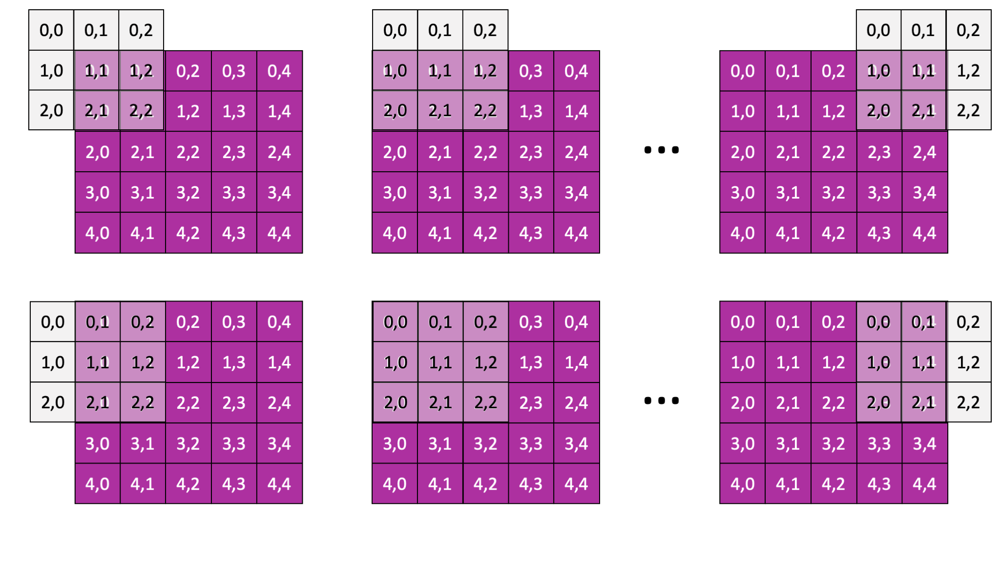

# Image Processing

This question is about using your understanding of caching and memory layout in C to improve a program's performance.

**Context**: It is possible to process digital images to do things such as make them blurry, make them sharper, find edges in the picture, etc. We can make all these modifications using the same code and algorithm, but applying different *filters* (discussed below). The program we give you takes an image and applies a blurring filter and then repeats that procedure 10 times. (Note: We start from the same image each time, so we are not applying the filter to the output of the previous trial, just running the same test repeatedly to be able to compute a meaningful average.)

The following explanation of how the image processing works should help you understand the code we give you; the code-reading questions will make sure you understand the critical parts of the program, so that you can begin optimizing it.

**Image representation**: An image is a collection of *pixels*. In the representation we use (which is a transformation of a `PNG` image), each pixel is represented by three one-byte values, corresponding to how much red, green, and blue color there is in the pixel. We sometimes say that each of these colors is a *layer*. So an image consists of a 2-dimensional array of pixels with three layers, each of which corresponds to one of the colors.

Translating this into a data structure, we represent an image as a 3-dimensional array. The first dimension is the number of layers; the second is the height (i.e., number of rows); the third is the width (i.e., the number of columns).

**Applying a filter**: A filter is a (small) N-by-N, for odd N, matrix of values. Applying the filter requires sliding the center of the filter matrix across the image and computing a new value for the value for each layer. In a given layer, we compute that new value by multiplying the filter value by its corresponding value from the image and then summing all these values. For example, if the filter is 3-by-3 (as it is in our code), we compute an output value as follows.

```
	output[layer][i][j] = filter[0][0] * input[layer][i-1][j-1] +
		filter[0][1] * input[layer][i-1][j] +
		filter[0][2] * input[layer][i-1][j+1] +
		filter[1][0] * input[layer][i][j-1] +
		filter[1][1] * input[layer][i][j] +
		filter[1][2] * input[layer][i][j+1] +
		filter[2][0] * input[layer][i+1][j-1] +
		filter[2][1] * input[layer][i+1][j] +
		filter[2][2] * input[layer][i+1][j+1]
```

The figure below shows how this works. The grey 3-by-3 filter is sliding across row 0 in the first three figures (we show the filter placement when computing output[layer][0][0], output[layer][0][1], and output[layer][0][4]) and across row 1 in the second three figures (we show the filter placement when computing output[layer][1][0], output[layer][1][1], and output[layer][1][4]).



You will notice that sometimes when you are trying to compute a new cell value, you will want to access invalid locations. For example, when computing `i = 0` and `j = 0`, computing `output[layer][i][j]` requires accessing `i - 1 = -1` and `j - 1 = -1`, and that would be outside the bounds of the image. **In this case, you must assume that the missing values are 0.**

Technically, the values in the matrix should sum to 1. However, this requires using floating point, and floating point calculations are sensitive to the order in which you perform them. Since we do not want your computation to depend on ordering, our code will normalize the values for you and round them back to integers. **You can ignore this**; we mention it only so that you understand how our calculations are slightly different from what a real image processing engine would do.

All the code that you will need to modify resides in the file `convolve.c`. Your job is to improve the performance of the (terrible) code we gave you. Pay particular attention to cache behavior. Your goal is to develop an implementation that takes only 4% of the time of the original/baseline implementation. Your implementation must, of course, also be correct! As in the last performance Lab, we encourage compiling after every change and running the test program in the terminal before submitting it to the server.

**Debugging tip**: If running in the workspace indicates that your output is different from what is expected, it is useful to figure out exactly how your output differs. (And you should run in the workspace first, before submitting to the grader.) You will find that the comparison is done in `utils.c` at line 160, using `memcmp`. You might find it useful to replace that call with a triply nested loop that prints out the indices of the bytes that do not match. This indicates where to look for your bug.

**Hint**: Remember our caching unit? It wasn't too long ago. How well does the current code structure do for caching? Then again, wasn't there another unit a while back where we worried about performance? Is there some code here that you already learned can be expensive, is important in particular cases, but *usually* doesn't matter at all? Maybe there's some clever way we could restructure the code to not bother with it when it doesn't matter? 
